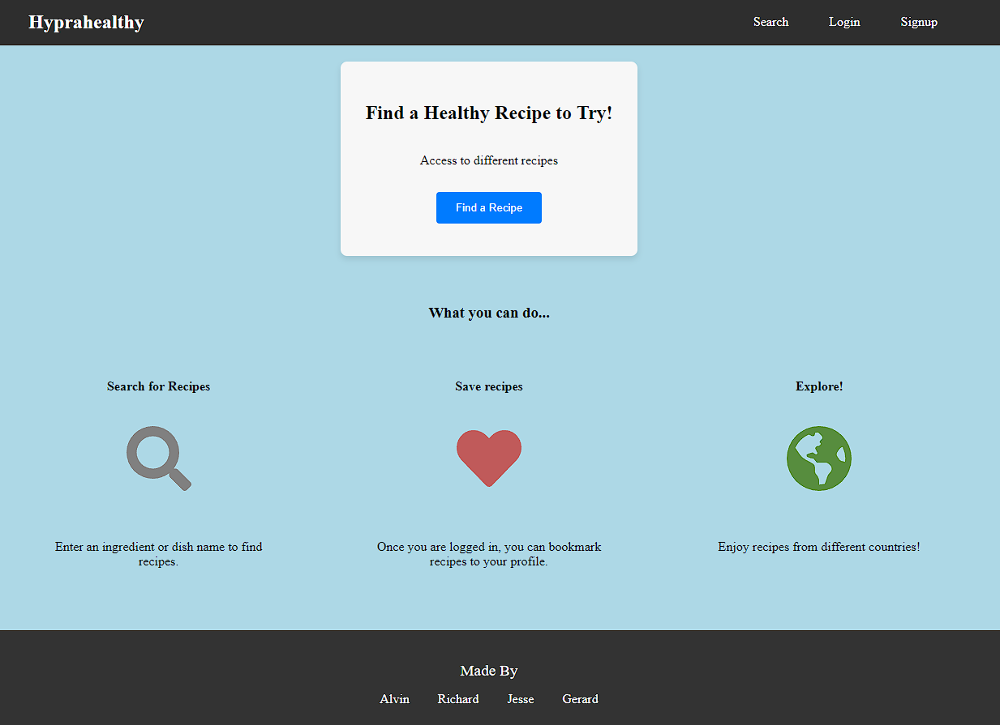
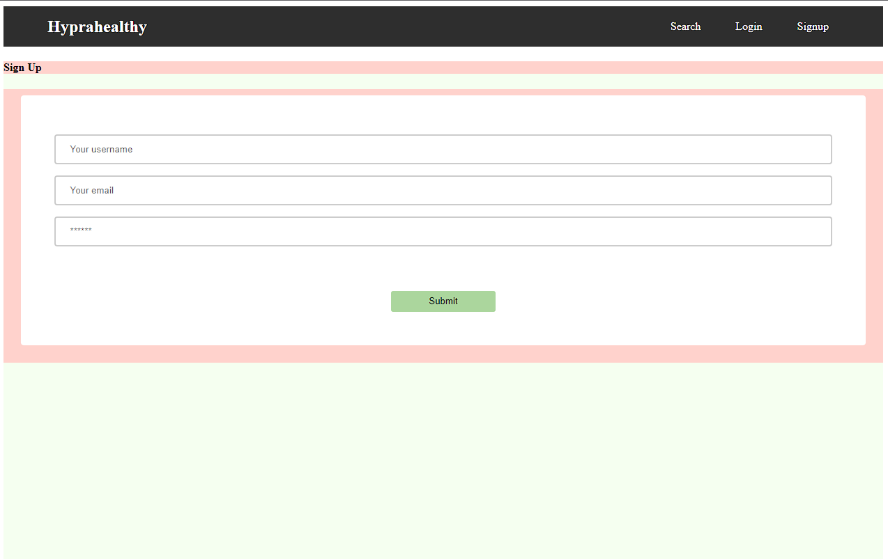

# Healthy-Journal (Group6)

## Table of Contents

- [Healthy-Journal (Group6)](#healthy-journal-group6)
  - [Table of Contents](#table-of-contents)
  - [Our Story](#our-story)
  - [Description](#description)
  - [Live URL](#live-url)
  - [Screenshots](#screenshots)
  - [Technologies Used](#technologies-used)
  - [Installation](#installation)
  - [Usage Information](#usage-information)
  - [Contributions](#contributions)
  - [Basic Acceptance Criteria](#basic-acceptance-criteria)
  - [License](#license)
  - [Questions](#questions)

 ## Our Story
 We decided on a health tracking website developed by our four dedicated individuals. We wanted a website to assist people who are beginning their healthy life journey to have an intuitive page and app to calculate their daily caloric intake, look for fantastic and healthy foods, and set up an exercise all on one page.
 Finally the application is a receipe finder app, with videos help to cook your delicious food.

## Description
👩🏻‍💻

Discover the art of balanced living with our comprehensive tools designed to empower your journey towards a healthier you.

🍽️ Calorie Tracer: Watch your nutrition come to life! Our intuitive calorie tracer helps you stay mindful of your daily intake. Simply input your meals and snacks to track your calories effortlessly.

🥦 Meal Prep Magic: Elevate your nutrition game with our Meal Prep Magic feature. Explore a treasure trove of wholesome recipes tailored to your dietary preferences. Plan and prepare your meals like a pro, ensuring a week filled with delicious, nourishing options.

🏃‍♂️ Exercise Finder: Unleash the power of movement! Our Exercise Finder offers a wide array of workout routines suitable for all fitness levels. Whether you're a yoga enthusiast, cardio chaser, or strength training buff, discover routines that ignite your passion for fitness.

Embark on a holistic journey towards optimal health with our calorie tracer, meal prep guidance, and exercise finder. Your well-being is our priority, and we're here to support you every step of the way. Let's create a vibrant, energized, and healthier version of you, together!"

## Live URL

📼
https://hyprahealthy-a6122d6a4506.herokuapp.com/

## Screenshots
📸

## Technologies Used
✅

## Installation

💾

1. Pull down and/or branch this repository
2. In Terminal run npm i
3. Then npm run deploy

## Usage Information

🔌
As a health-conscious individual,
I want to easily track various aspects of my daily health such as meals, exercise, mood, symptoms, and more,
On this easy-to use page, you will log in and have access to apps to help you find the information and exercise you need to better yourself.

## Contributions
💬

Alvin Joyner            
Jesse Elkins             
Richard Murillo      
Gerard Del Vecchio
Our TA Mateo Wallace for all the tips and help we recieved during class.

## Basic Acceptance Criteria

📖

* Use React for the front end.

* Use GraphQL with a Node.js and Express.js server.

* Use MongoDB and the Mongoose ODM for the database.

* Use queries and mutations for retrieving, adding, updating, and deleting data.

* Be deployed using Heroku (with data).

* Have a polished UI.

* Be responsive.

* Be interactive (i.e., accept and respond to user input).

* Include authentication (JWT).

* Protect sensitive API key information on the server.

* Have a clean repository that meets quality coding standards (file structure, naming conventions, best practices for class and id naming conventions, indentation, high-quality comments, etc.).

* Have a high-quality README (with unique name, description, technologies used, screenshot, and link to deployed application).

## License
📝

NOTICE: This application is covered under the MIT

## Questions

👥

Have additional questions? Click the links below to reach me through my GitHub account or Email address.

[Link to Github](https://github.com/Gdel-J/healthy-Journal.git)

<a href="mailto:grizzlylbc1@gmail.com">Richard Murillo Email</a>

<a href="mailto:alvinjoyner3@gmail.com">Alvin Joyner Email</a>

<a href="mailto:">Jesse Elkins Email</a>

<a href="mailto:jessygdelvecchio@gmail.com">Gerard Del Vecchio Email</a>